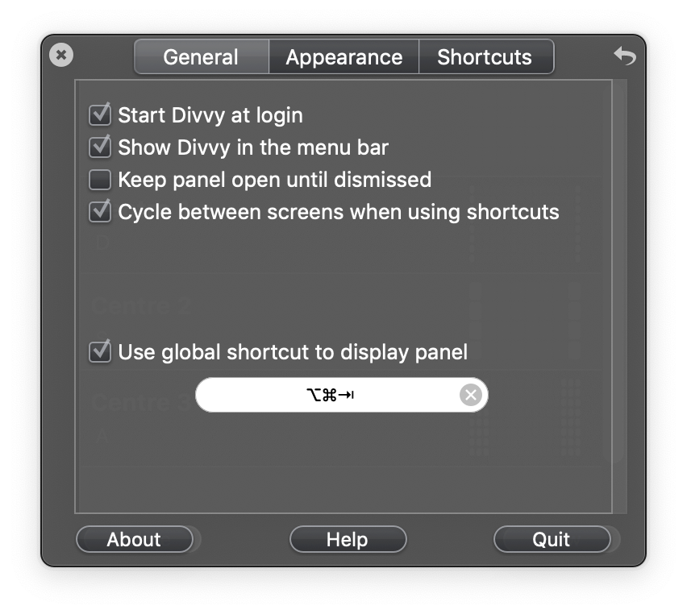
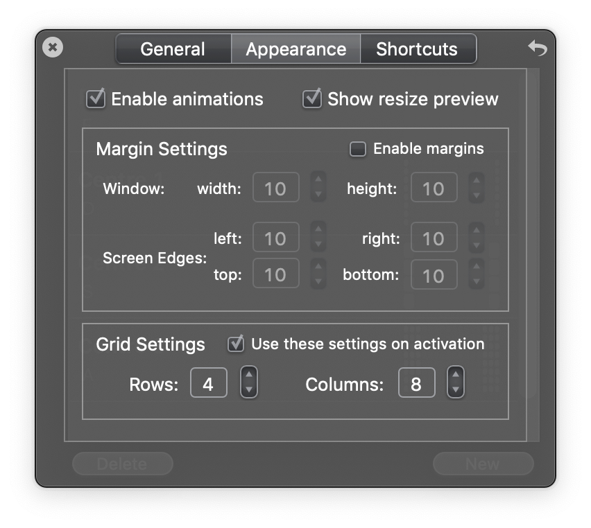
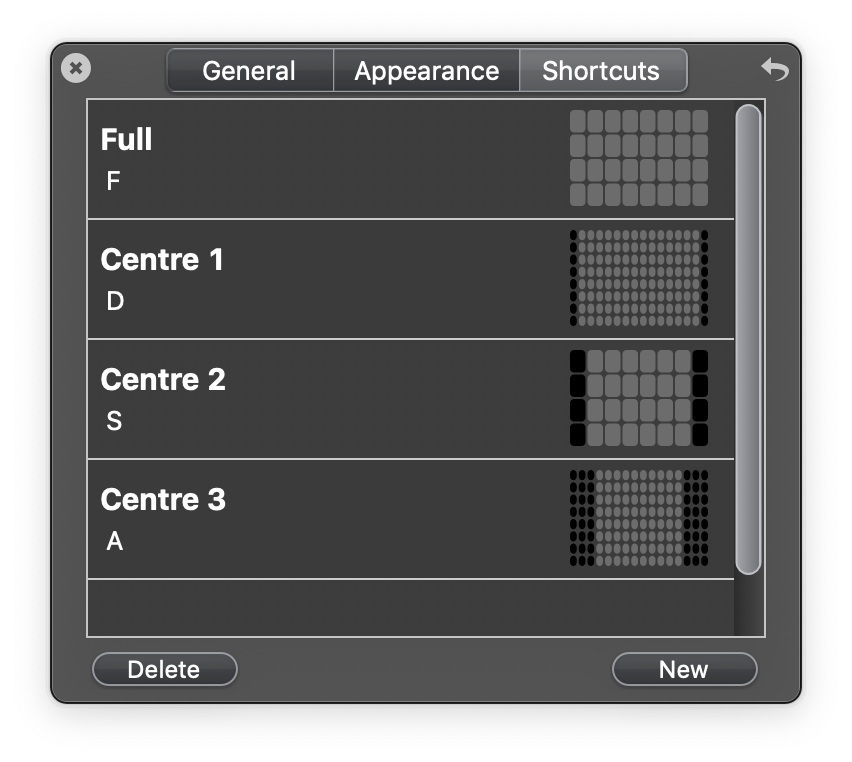

# macOS

## Install Xcode tools

Install Xcode's Command Line Tools (CLT):

```sh
xcode-select --install
```

Later, if you run into errors like "unable to find utility 'clang'", you might have an old version of Xcode installed. Delete/upgrade it and try again.

## Install Homebrew

Install [Homebrew](https://brew.sh).

Install more software using Homebrew:

```sh
brew bundle install
```

Diagnose problems with the Homebrew environment:

```sh
brew doctor
```

## Set shell to Bash 5

Install Bash with Homebrew:

```sh
brew install bash bash-completion@2
```

Add Homebrew's Bash build to the list of available shells:

```sh
sudo vim /etc/shells
# append: /usr/local/bin/bash
```

Change the shell:

```sh
chsh -s /usr/local/bin/bash
```

Then restart the terminal session.

## Divvy



---

## Unmaintained

### Safari

See the [Safari](Safari.md) document.

### Terminal

`Inky Grey.terminal` is a dark theme for the native Terminal app.

Open this file to install it in Terminal. Afterwards, open the Preferences
window, select the theme in the Profiles tab, and select Default.

### Xcode

`base16-eighties.dark.dvtcolortheme` is a variant of an Xcode theme from
[joedynamite/base16-xcode](https://github.com/joedynamite/base16-xcode) on
GitHub, modified to use the Source Code Pro font.

To install the theme, run the following command which will copy the theme file
to the appropriate directory:

```sh
cp ./*.dvtcolortheme ~/Library/Developer/Xcode/UserData/FontAndColorThemes
```

Restart Xcode. The theme should now be available in the Preferences window on
the 'Fonts & Colors' tab.
